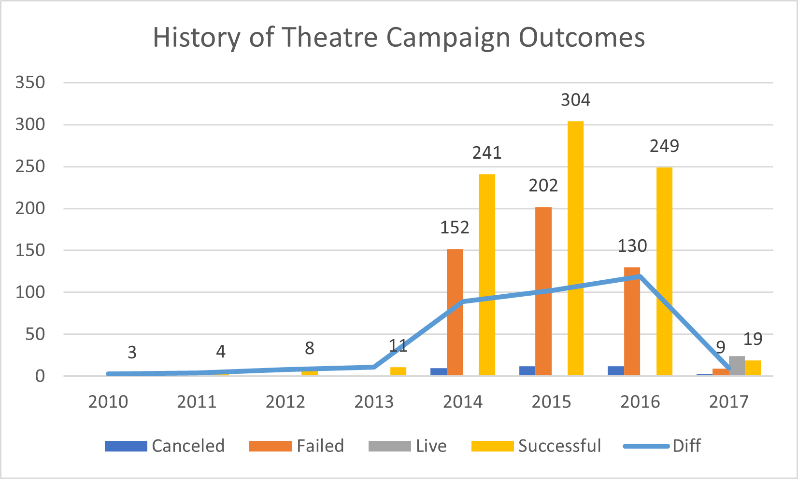
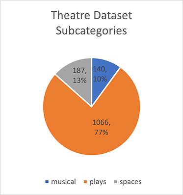
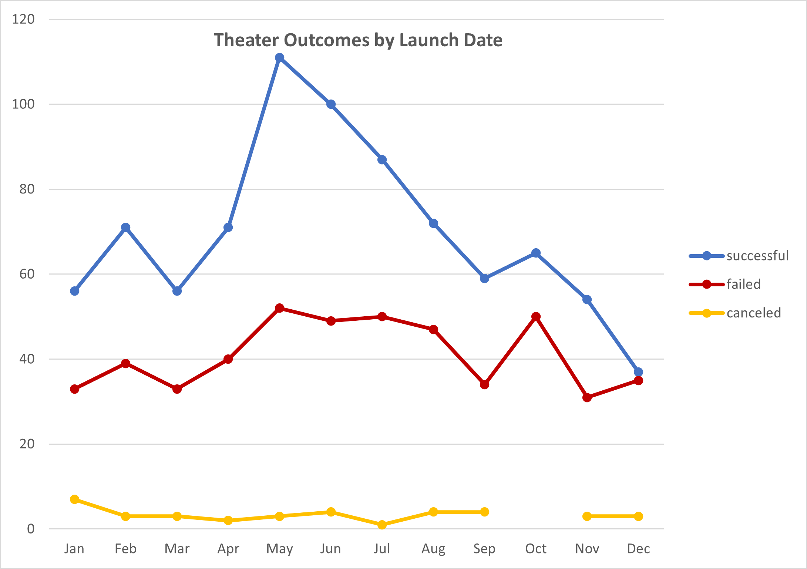
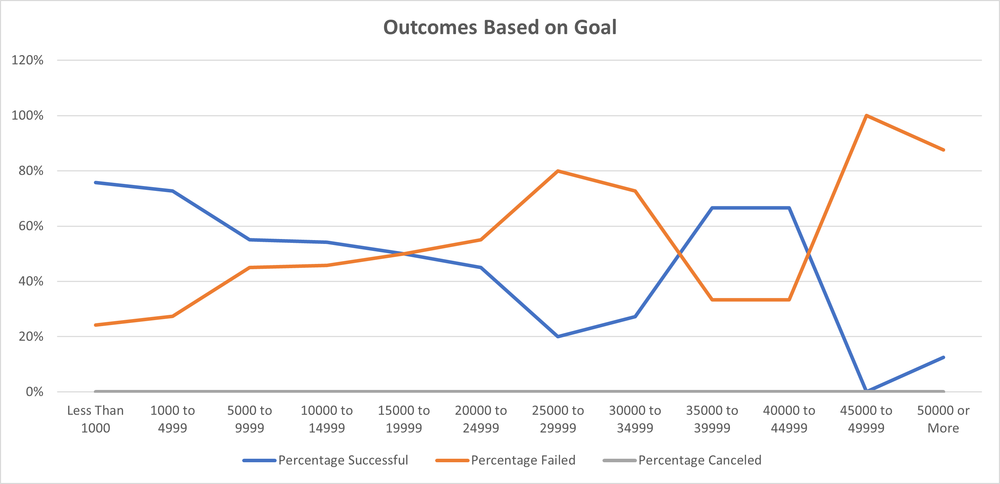

# Kickstarting with Excel

## Overview of Project
In an effort to develop a successful crowdfunding campaign for the production of a play called "Fever", crowdfunding data from around the world for various types of events or projects were obtained and analyzed. The playwriter has estimated a budget of approximately $10,000 to fund the play. 

### Purpose
The purpose of the project is to review, analyze, and identify possible factors that may contribute to the success or failure of a crowdfunding campaign.

## Analysis and Challenges

### Description of "US Theatre" Dataset
We used a large dataset of 1,393 crowdfunding campaigns for theatres from Jul 2010 thru Feb 2017. The bulk of the data shows the use of croowdfunding increasing with increaseing success starting from 2014 thru 2016 as desmonstrated by the "Diff" line which shows difference between successful outcomes vs. failed. There are three (3) subcategories of theatre within the dataset. Fortunately, "plays" which is the focus of our analysis is the dominante subcategory with 77% of the dataset.

### Analysis of Outcomes Based on Launch Date

### Analysis of Outcomes Based on Goals

### Challenges and Difficulties Encountered
There is a problem with the dataset. There are some outliers within Goals that are causing uncessary skewing. The Median is 3,000, Mode is $5,000 and the Mean is $46,831.85. A major identified is a Goal of $30 Million dollars. When the $30M outlier was removed, the Mean changed to $25,313.77 with a standard devisation of $200,583 vs $827,769 previously.

## Results
- What are two conclusions you can draw about the Outcomes based on Launch Date?
It seems that throughout the years, more campaigns were launched from Apr thru Jul with May being the most popular launch month. The difference between successful vs failed is the greatest in within the months of May and June.

- What can you conclude about the Outcomes based on Goals?
We also compared the outcomes of various funding goals. Funding goals of $1,000 or less exhibited the most success, followed by $35,000 thru $45,000, and lastly $5,000 thru $15,000. Failed goals tend to be within the range of $15,000 thru $35,000 and anything above $45,000. "Fever" funding goal of $10,000 with still within the successful range.

- What are some limitations of this dataset?

- What are some other possible tables and/or graphs that we could create?
A histogram from the goals and pledges would help visualize the mean, mode, skewness and where the outliers are.
